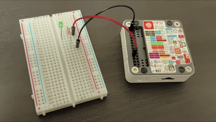
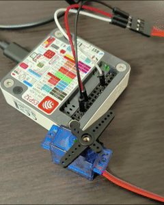
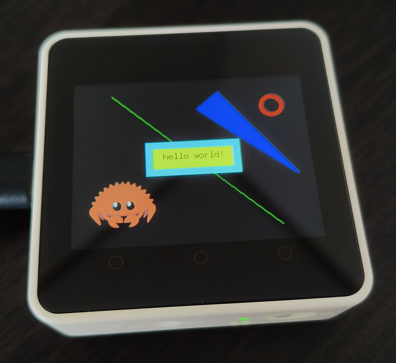
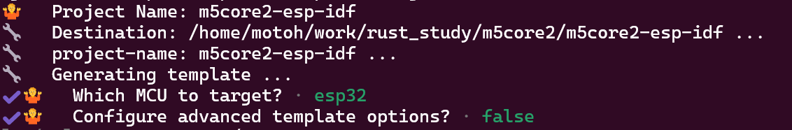
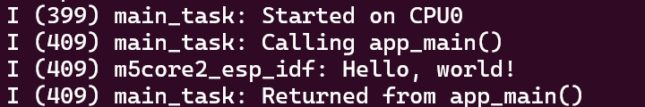
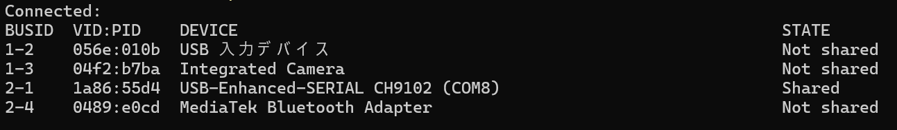

# rust-on-m5stack-core2-examples
M5Stack Core2で実行できるRustのExample集です。  
no_stdではなく、[esp-idf-hal](https://github.com/esp-rs/esp-idf-hal/tree/master)を利用しています。


**Contents:**
- [各Exampleの概要](#各exampleの概要)
  - [led\_blink](#led_blink)
  - [led\_pwm](#led_pwm)
  - [pwm\_servo](#pwm_servo)
  - [lcd\_ili9342c](#lcd_ili9342c)
  - [touch\_ft6x36u](#touch_ft6x36u)
  - [imu\_mpu6886](#imu_mpu6886)
- [開発環境インストール手順](#開発環境インストール手順)
  - [Rustインストール](#rustインストール)
  - [ESPツールチェーンをインストール](#espツールチェーンをインストール)
  - [cargo-generate (テンプレートからプロジェクトを作成するツール)をインストール](#cargo-generate-テンプレートからプロジェクトを作成するツールをインストール)
  - [テンプレートからプロジェクトを作成](#テンプレートからプロジェクトを作成)
  - [Build \& Flash](#build--flash)
  - [USBをWSL2にバインドする手順](#usbをwsl2にバインドする手順)
- [参考資料](#参考資料)


## 各Exampleの概要
> Note:  
> examplesフォルダのソースファイル(.rs)は次のコマンドでビルド、実行できます（事前に次節「開発環境インストール手順」を済ませてください）。

```
cargo build --example led_blink
cargo run --example led_blink
```

### led_blink
M5Stack Core2のGPIO G27のHigh/Lowを切り替えてLチカします。
esp-idf-halのExampleをベースにしています。



### led_pwm
M5Stack Core2のGPIO G27からPWM制御でパルスを出力します。Dutyが0～100%で変化するので、上記led_blinkと同じようにLEDを接続するとLEDの明るさが変化します。コードはesp-idf-halのExampleのledc_simple.rsほぼそのままです。

### pwm_servo
上記led_pwmのPWM制御の周期、パルス幅の範囲をサーボモーター向けに変更したものです。




### lcd_ili9342c
M5Stack Core2に搭載されているLCD ili9342cに図形や画像を描画します。  
書籍「基礎から学ぶ 組込みRust」（出版：株式会社C&R研究所　著者：中林 智之／井田 健太）で紹介されているWio Terminal向けのサンプルプログラムをM5Stack Core2向けにカスタマイズしています。

> Note:  
> M5Stack Core2では、電源管理チップAXP192からLCDに電源を供給する仕様のため、サンプルプログラムにはAXP192の制御も含まれています。M5Stack Core2 v1.1では電源管理チップが変更になっているため動作しません。



### touch_ft6x36u
M5Stack Core2の画面タッチを検出し、座標と判定した操作（1点のタッチ or スワイプ）をシリアルモニタにログ出力します。

> Note:  
> ・M5Stack Core2はボタンA/B/Cのタッチも画面タッチとして検出します。このサンプルプログラムでもボタンA/B/Cをタッチすると座標が表示されます。  
> ・M5Stack Core2では、電源管理チップAXP192でFT6336Uをリセットする仕様のため、サンプルプログラムにはAXP192の制御も含まれています。M5Stack Core2 v1.1では電源管理チップが変更になっているため動作しません。

### imu_mpu6886
M5Stack Core2に搭載されているIMU MPU6886から、I2Cで加速度と角速度を読み取り、シリアルモニタに出力します。  
こちらの記事[「M5StackをRustで動かす」](https://zenn.dev/teruyamato0731/scraps/eaf1afddd92124)で紹介されているコードを、最新のesp-idf-halに合わせて一部修正しています。投稿者様の許可を得られたためコードを公開します。

> Note:  
> Core2 v1.3以降ではIMUのチップが変更になっているため動作しません。

## 開発環境インストール手順
Ubuntu (WSL2)へのインストール手順を記載します。

### Rustインストール

```
$ sudo apt update
$ sudo apt upgrade
$ sudo apt install gcc
```

> Note:  
> RustコンパイラはCコンパイラのリンカを使うためgccをインストールしておく。

[Rustのページ](https://rustup.rs/)でインストールコマンドをコピーして実行。

```
$ curl --proto '=https' --tlsv1.2 -sSf https://sh.rustup.rs | sh
```

環境変数を読み込むために、一度ターミナルを閉じて再ログインする。

インストールできたことを確認。
```
$ rustup --version
$ rustc --version
$ cargo --version
```

PC上でHello Worldの確認。  

```
$ cargo new hello
$ cd hello
$ cargo run
```

### ESPツールチェーンをインストール

```
$ cargo install espup --locked
$ espup install
```

環境変数設定。**これはターミナルを起動するたびに実行する必要がある**。
```
$ . ~/export-esp.sh
```

### cargo-generate (テンプレートからプロジェクトを作成するツール)をインストール

```
$ cargo install ldproxy
$ cargo install cargo-generate
```

### テンプレートからプロジェクトを作成
> Note:  
> 本リポジトリも同じテンプレートからプロジェクトを作成しています。本リポジトリをCloneすればプロジェクト作成はスキップできます。

作業フォルダで次のコマンドを実行する。
```
$ cargo generate --vcs none --git https://github.com/esp-rs/esp-idf-template cargo
```
対話形式でプロジェクト名、MCUなどを設定する。M5Stack Core2の場合、MCUはESP32。


### Build & Flash
> Note:  
> WSL2の場合は、事前に次節「USBをWSL2にバインドする手順」に沿ってUSBをWSL2側に接続してください。

作成したプロジェクトのフォルダに移動。
```
$ cd m5core2-esp-idf
```

ビルド、実行するとターミナルにシリアルログ（Hello world）が表示される。
```
$ cargo build
$ cargo run
```


### USBをWSL2にバインドする手順
Windows側PowerShellでusbipdをインストール。
```
$ winget install --interactive --exact dorssel.usbipd-win
```

PCとM5StackをUSBで接続。**以降の手順はUSBを接続するたびに行う必要がある。**

PowerShellで以下を実行し、出力されたリストからM5Stackに接続されているUSBのbusidを探す（ここでは2-1）。
```
$ usbipd list
```


busidに対してバインドを実行。
```
$ usbipd bind --busid 2-1
```

もう一度リストを表示し、busidがsharedになったかを確認。（※上のスクリーンショットでは最初からsharedになっています。）
```
$ usbipd list
```

busidに対してWSL2への接続を実行。
```
$ usbipd attach --wsl --busid 2-1
```

Ubuntu(WSL2)側で接続されたUSBデバイスを確認。
```
$ dmesg | grep tty
```


デバイスに対するアクセス権を設定。
```
$ sudo chmod 777 /dev/ttyACM0
```

## 参考資料
- 「基礎から学ぶ 組込みRust」（出版：株式会社C&R研究所　著者：中林 智之／井田 健太）
- [ESP32でstdなRust開発入門 -Lang-ship](https://lang-ship.com/blog/work/esp32-std-rust-1/)
- [M5StackをRustで動かす](https://zenn.dev/teruyamato0731/scraps/eaf1afddd92124)